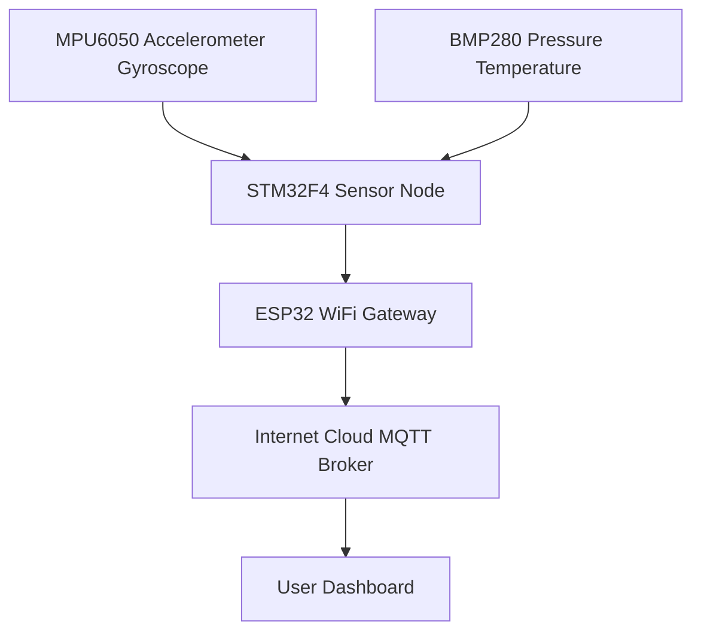

# Dual MCU Wireless Industrial Monitoring System (STM32 + ESP32)

‎“Wireless Industrial Monitoring System using STM32 and ESP32 (Battery-powered + IoT + Safety)”‎

---

title: "Dual MCU Sensor Gateway"  
description: "A wireless industrial monitoring system where STM32 collects sensor data and sends it to ESP32 for network transmission using UART and FreeRTOS."

---

## Introduction

This project demonstrates how to build a **dual-MCU wireless monitoring system** using **STM32** and **ESP32**.  
The STM32 microcontroller functions as a **sensor acquisition unit**, collecting data from multiple sensors such as the **MPU6050 (accelerometer/gyroscope)** and **BMP280 (temperature/pressure)**.  
The **ESP32** acts as the **communication gateway**, receiving data via UART from the STM32 and transmitting it wirelessly (Wi-Fi, MQTT, or serial monitor).

This architecture is ideal for industrial IoT applications where reliability, modularity, and real-time operation are crucial.

---

## System Overview

### Architecture Description

The system consists of two microcontrollers:

1. **STM32** – Sensor Node  
   - Reads environmental and motion data from sensors  
   - Uses **FreeRTOS** for task management  
   - Sends structured sensor data via UART to ESP32  

2. **ESP32** – Wireless Gateway  
   - Receives data from STM32 through UART  
   - Can transmit to a cloud platform or local server via Wi-Fi  
   - Acts as the interface for monitoring or control  

### System Diagram



---

## Required Hardware

| Component | Description |
|------------|-------------|
| **STM32 Nucleo-F446RE** | Main MCU for sensor acquisition |
| **ESP32 DevKit v1** | Wi-Fi gateway module |
| **MPU6050** | 3-axis accelerometer + gyroscope |
| **BMP280** | Pressure and temperature sensor |
| **Jumper wires** | UART and I2C connections |
| **Breadboard / PCB** | For wiring and prototyping |
| **USB cables** | For programming both MCUs |

---

## Required Software

1. **STM32CubeIDE** – for STM32 development  
2. **STM32CubeMX** – peripheral configuration and code generation  
3. **Arduino IDE** – for ESP32 firmware  
4. **FreeRTOS** – multitasking on STM32  
5. **HAL Drivers** – for STM32 I2C, UART, GPIO  
6. **MPU6050 and BMP280 libraries**  
7. **Serial monitor or MQTT dashboard** for testing output  

---

## STM32 Configuration and Implementation

### Hardware Connections (STM32 Side)

| Sensor | Interface | STM32 Pins |
|--------|------------|-------------|
| MPU6050 | I2C3 | SDA (PC9), SCL (PA8) |
| BMP280 | I2C3 | SDA (PC9), SCL (PA8) |
| UART to ESP32 | UART4 TX → ESP32 RX, UART4 RX → ESP32 TX |

### Software Structure

STM32 firmware uses **FreeRTOS** with three main tasks:

1. **MPU Task** – Reads accelerometer and gyroscope data from MPU6050  
2. **BMP Task** – Reads temperature and pressure from BMP280  
3. **Data Task** – Collects data from both sensors via queue and sends it over UART  

### Task Communication

Tasks communicate through an **xQueue**:
```c
xSensorQueue = xQueueCreate(5, sizeof(SensorData_t));
```

Each sensor task sends a `SensorData_t` structure containing:
```c
typedef struct {
  taskId_t taskId;
  float ax, ay, az;
  float gx, gy, gz;
  float temperature;
  float pressure;
} SensorData_t;
```

### Data Transmission (UART)

Collected data is sent to both **UART2 (for debugging)** and **UART4 (to ESP32)**:
```c
HAL_UART_Transmit(&huart4, (uint8_t*)buffer, strlen(buffer), HAL_MAX_DELAY);
```

Example transmitted data:
```
MPU -> Accel: X=0.05 Y=-0.10 Z=9.81 | Gyro: X=0.2 Y=-0.1 Z=0.5
BMP -> Temp=26.5C | Press=1013.3hPa
```

---

## ESP32 Configuration and Implementation

### Function Overview

The ESP32 receives the formatted data from STM32 through UART, parses it, and can:

- Display it on the serial monitor  
- Publish it to an **MQTT broker** (optional)  
- Send it to a **web dashboard** or cloud API  

### Example UART Reception Code (from `sketch_oct18a.ino`)

```cpp
void setup() {
  Serial.begin(115200);        // For PC monitor
  Serial2.begin(115200, SERIAL_8N1, 16, 17);  // UART2 (RX=16, TX=17)
}

void loop() {
  if (Serial2.available()) {
    String data = Serial2.readStringUntil('\n');
    Serial.println(data);   // Display on serial monitor
    // Optional: Publish data to MQTT or cloud service
  }
}
```

### ESP32 Pin Mapping

| ESP32 Pin | STM32 Pin | Function |
|------------|------------|----------|
| GPIO16 (RX2) | UART4 TX | Data reception |
| GPIO17 (TX2) | UART4 RX | Debug (optional) |
| 3.3V | 3.3V | Power |
| GND | GND | Common ground |

---

## Project Structure

```
Dual_MCU_Monitoring_System/
├── STM32_Firmware/
│   ├── Core/
│   │   ├── Inc/
│   │   └── Src/
│   ├── Drivers/
│   ├── Middlewares/FreeRTOS/
│   ├── main.c
│   ├── mpu6050.c / .h
│   ├── bmp280.c / .h
│   └── ...
│
├── ESP32_Firmware/
│   ├── sketch_oct18a.ino
│   ├── WiFi_MQTT.ino (optional)
│   └── ...
└── README.md
```

---

## Running the Project

1. **Program the STM32** using STM32CubeIDE.  
   - Make sure the MPU6050 and BMP280 are connected correctly.  
   - Confirm UART4 TX/RX wiring to ESP32.  

2. **Program the ESP32** using Arduino IDE.  
   - Select correct COM port and board (ESP32 DevKit).  
   - Open the Serial Monitor at 115200 baud.  

3. **Power both devices** and watch real-time sensor data appear in the Serial Monitor.  

4. (Optional) Extend ESP32 firmware to publish data via MQTT or HTTP.  

---

## Example Output

```
MPU -> Accel: X=0.03 Y=-0.07 Z=9.80 | Gyro: X=0.25 Y=-0.11 Z=0.43
BMP -> Temp=26.47C | Press=1012.95hPa
MPU -> Accel: X=0.04 Y=-0.09 Z=9.82 | Gyro: X=0.23 Y=-0.09 Z=0.40
```

---

## Future Improvements

- Add **battery monitoring** and low-power sleep modes  
- Implement **Wi-Fi or BLE streaming** directly from STM32 via ESP32 bridge  
- Add **edge filtering** and **sensor fusion (Kalman)** on STM32  
- Integrate with **MQTT dashboards** like ThingsBoard, HiveMQ, or AWS IoT Core  

---

## Conclusion

This project demonstrates a modular and scalable approach to building an industrial IoT monitoring system using two microcontrollers.  
The STM32 efficiently handles sensor data collection under FreeRTOS, while the ESP32 provides network connectivity, enabling reliable and flexible wireless data transmission.  
